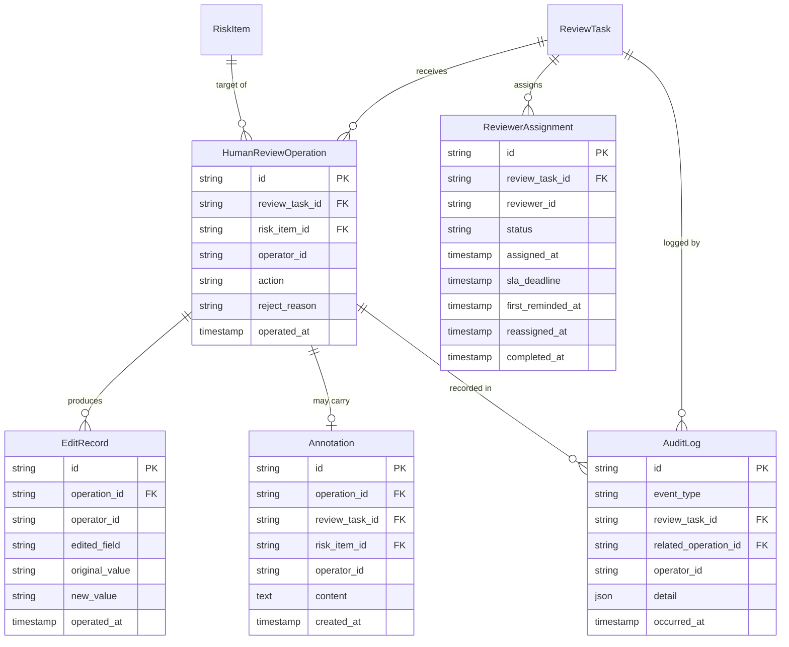

# 人机交互（HITL）操作数据模型

**阶段**：07_data_model  
**输出方**：Teammate 3  
**日期**：2026-04-15  
**版本**：v1.0  
**依据文档**：
- `docs/04_interaction_design/interactive-design-spec-v1.0.md`（第四章 HITL 链路、§五.4 审计日志）
- `docs/04_interaction_design/human_review_hitl_flow.md`
- `docs/06_system_architecture/frontend-backend-boundary-spec.md`

---

## 一、概述

本文件覆盖以下核心实体：

| 实体 | 用途 |
|------|------|
| `HumanReviewOperation` | 记录每次人工审核操作（approve/edit/reject_item/reject_task/annotate） |
| `EditRecord` | 编辑操作专属字段级变更记录（独立表，支持一次edit修改多字段） |
| `Annotation` | 批注记录，独立存在，不影响条目处理状态 |
| `AuditLog` | 全链路不可变审计日志（只追加，不修改/删除） |
| `ReviewerAssignment` | 审核人分配记录，支持历史追踪和 SLA 监控 |

---

## 二、实体关系图



---

## 三、实体详细字段说明

### 3.1 HumanReviewOperation — 人工审核操作记录

| 字段名 | 类型 | 必填 | 标注 | 说明 |
|--------|------|------|------|------|
| `id` | VARCHAR(36) | 是 | [BE Required] | UUID |
| `review_task_id` | VARCHAR(36) | 是 | [FE Required] [BE Required] | 外键 → ReviewTask.id |
| `risk_item_id` | VARCHAR(36) | 否 | [BE Required] | 外键 → RiskItem.id；条目级操作（approve/edit/reject_item/annotate）时必填；任务级操作（reject_task）时为 null |
| `operator_id` | VARCHAR(36) | 是 | [FE Required] [BE Required] | 操作人用户ID，用于审计展示和权限校验 |
| `action` | ENUM | 是 | [FE Required] [BE Required] | 操作类型，见枚举 §四.1 |
| `reject_reason` | TEXT | 条件必填 | [FE Required] [BE Required] | 驳回原因；`action=reject_item` 时 ≥ 10 字符；`action=reject_task` 时 ≥ 20 字符；其他操作为 null |
| `operated_at` | TIMESTAMP | 是 | [FE Required] [BE Required] | 操作时间戳，审计日志和前端操作历史展示 |

### 3.2 EditRecord — 字段级编辑记录

> **设计说明**：独立成表而非内嵌，原因是一次 edit 操作可同时修改多个字段（如同时改 `risk_level` + `risk_description`），独立表支持逐字段审计追溯。

| 字段名 | 类型 | 必填 | 标注 | 说明 |
|--------|------|------|------|------|
| `id` | VARCHAR(36) | 是 | [BE Required] | UUID |
| `operation_id` | VARCHAR(36) | 是 | [BE Required] | 外键 → HumanReviewOperation.id（action 必须为 `edit`） |
| `operator_id` | VARCHAR(36) | 是 | [BE Required] | 操作人用户ID（冗余自 HumanReviewOperation，便于独立查询） |
| `edited_field` | ENUM | 是 | [FE Required] [BE Required] | 被编辑的字段名，见枚举 §四.3；只有允许编辑的字段才可产生 EditRecord |
| `original_value` | TEXT | 是 | [FE Required] [BE Required] | 原始值（字符串序列化），前端展示原值/新值 diff |
| `new_value` | TEXT | 是 | [FE Required] [BE Required] | 修改后的值（字符串序列化） |
| `operated_at` | TIMESTAMP | 是 | [FE Required] [BE Required] | 编辑时间戳 |

**可编辑字段约束（来自 interactive-design-spec §四.2）**：

| 字段 | 可编辑 | 说明 |
|------|--------|------|
| `risk_level` | 是 | 人工可调整风险等级 |
| `risk_description` | 是 | 人工可修改风险描述 |
| `reasoning` | 是 | 人工可修改 AI 推理说明 |
| `risk_type` | **否** | 保留 AI 原始记录，不可修改 |
| `confidence_score` | **否** | 保留 AI 原始记录，不可修改 |
| `location_page` / `location_paragraph` | **否** | 原文定位不可修改，保留 AI 原始记录 |

### 3.3 Annotation — 批注记录

> **设计说明**：独立成表，可独立存在，不依赖同意/编辑/驳回操作；MVP 单人单次，不支持多人线程（V2 功能）。

| 字段名 | 类型 | 必填 | 标注 | 说明 |
|--------|------|------|------|------|
| `id` | VARCHAR(36) | 是 | [BE Required] | UUID |
| `operation_id` | VARCHAR(36) | 是 | [BE Required] | 外键 → HumanReviewOperation.id（action 必须为 `annotate`） |
| `review_task_id` | VARCHAR(36) | 是 | [FE Required] [BE Required] | 冗余关联 → ReviewTask.id，便于按任务查询所有批注 |
| `risk_item_id` | VARCHAR(36) | 否 | [FE Required] | 冗余关联 → RiskItem.id；批注关联具体条目时填写，任务级批注为 null |
| `operator_id` | VARCHAR(36) | 是 | [FE Required] [BE Required] | 批注人用户ID |
| `content` | TEXT | 是 | [FE Required] [BE Required] | 批注内容正文 |
| `created_at` | TIMESTAMP | 是 | [FE Required] [BE Required] | 批注创建时间 |

### 3.4 AuditLog — 不可变审计日志

> **约束：只追加，不修改，不删除。**  
> 覆盖三类事件：状态变更（`task_status_change`）、人工操作（`human_action`）、向量库版本绑定（`vector_db_bind`）。

| 字段名 | 类型 | 必填 | 标注 | 说明 |
|--------|------|------|------|------|
| `id` | VARCHAR(36) | 是 | [BE Required] | UUID（自增或有序UUID，确保可追溯时间顺序） |
| `event_type` | ENUM | 是 | [BE Required] | 事件类型，见枚举 §四.4 |
| `review_task_id` | VARCHAR(36) | 是 | [BE Required] | 关联 ReviewTask.id（所有审计事件必须绑定任务） |
| `related_operation_id` | VARCHAR(36) | 否 | [BE Required] | 关联 HumanReviewOperation.id；人工操作事件时填写，系统事件为 null |
| `operator_id` | VARCHAR(36) | 否 | [BE Required] | 操作人ID；人工操作时必填；系统自动触发为 null |
| `detail` | JSON | 是 | [BE Required] | 事件详情，不同 event_type 的 JSON 结构见 §五 |
| `occurred_at` | TIMESTAMP | 是 | [BE Required] | 事件发生时间（数据库写入前由应用层设置，不使用数据库默认时间） |

### 3.5 ReviewerAssignment — 审核人分配记录

> **设计说明**：独立成表而非挂字段在 ReviewTask，原因是支持历史追踪（一个任务可能多次重分配），完整保留分配历史。

| 字段名 | 类型 | 必填 | 标注 | 说明 |
|--------|------|------|------|------|
| `id` | VARCHAR(36) | 是 | [BE Required] | UUID |
| `review_task_id` | VARCHAR(36) | 是 | [BE Required] | 外键 → ReviewTask.id |
| `reviewer_id` | VARCHAR(36) | 是 | [FE Required] [BE Required] | 被分配的审核员用户ID |
| `status` | ENUM | 是 | [FE Required] [BE Required] | 分配状态，见枚举 §四.5 |
| `assigned_at` | TIMESTAMP | 是 | [FE Required] [BE Required] | 分配时间 |
| `sla_deadline` | TIMESTAMP | 是 | [BE Required] | SLA截止时间（`assigned_at` + 60分钟），超期触发重分配 |
| `first_reminded_at` | TIMESTAMP | 否 | [BE Required] | 首次催办时间（`assigned_at` + 30分钟阈值触发），未催办时为 null |
| `reassigned_at` | TIMESTAMP | 否 | [BE Required] | 重分配时间（60分钟阈值触发，此条记录变为 `replaced`），记录重分配发生时刻 |
| `completed_at` | TIMESTAMP | 否 | [BE Required] | 审核员完成审核时间（人工审核完成时更新此记录状态为 `completed`） |

---

## 四、枚举类型定义

### 4.1 HumanReviewOperation.action — 操作类型

| 枚举值 | 作用对象 | 含义 | 对 ReviewTask 的影响 |
|--------|---------|------|-------------------|
| `approve` | 单条 RiskItem | 人工确认 AI 结论，认为风险项正确 | 无，任务继续 |
| `edit` | 单条 RiskItem | 编辑 AI 结论（风险等级/描述/推理） | 无，任务继续 |
| `reject_item` | 单条 RiskItem | 单条驳回，认为该风险项无效 | 无，任务继续 |
| `reject_task` | 整个 ReviewTask | 整体任务驳回 | **立即流转至 `rejected`（终态），不可恢复** |
| `annotate` | 单条 RiskItem 或任务 | 添加批注，不影响处理状态 | 无 |

### 4.2 操作完成条件（由后端校验）

| 条件 | 说明 |
|------|------|
| 完成审核前置条件 | 所有 `risk_level` 为 `critical` 或 `high` 的 RiskItem 的 `reviewer_status` 均不为 `pending` |
| reject_task 前置条件 | `reject_reason` 长度 ≥ 20 字符，且前端必须弹出二次确认弹窗 |
| reject_item 前置条件 | `reject_reason` 长度 ≥ 10 字符 |

### 4.3 EditRecord.edited_field — 可编辑字段枚举

| 枚举值 | 含义 |
|--------|------|
| `risk_level` | 风险等级（critical/high/medium/low） |
| `risk_description` | 风险描述文字 |
| `reasoning` | AI 推理说明 |

### 4.4 AuditLog.event_type — 事件类型

| 枚举值 | 含义 | detail JSON 结构 |
|--------|------|-----------------|
| `task_status_change` | ReviewTask 状态变更 | `{old_status, new_status, triggered_by: "system/user/timeout", trigger_detail}` |
| `human_action` | 人工审核操作 | `{operator_id, action, target_type: "risk_item/review_task", target_id, summary}` |
| `vector_db_bind` | 向量库版本绑定 | `{vector_db_version, bound_at}` |

### 4.5 ReviewerAssignment.status — 分配状态

| 枚举值 | 含义 |
|--------|------|
| `active` | 当前生效的分配记录，审核员正在处理 |
| `replaced` | 已被重分配替代，该记录历史存档 |
| `completed` | 审核员已完成审核 |

---

## 五、审计日志覆盖范围与 detail 结构

### 5.1 task_status_change — 状态变更事件

```json
{
  "old_status": "auto_reviewed",
  "new_status": "human_reviewing",
  "triggered_by": "system",
  "trigger_detail": "HITL触发：critical_count=2，自动流转至人工审核"
}
```

### 5.2 human_action — 人工操作事件

```json
{
  "operator_id": "user-123",
  "action": "edit",
  "target_type": "risk_item",
  "target_id": "risk-item-456",
  "summary": "修改 risk_level: high → critical，修改 risk_description"
}
```

### 5.3 vector_db_bind — 向量库版本绑定事件

```json
{
  "vector_db_version": "v20260415-001",
  "bound_at": "2026-04-15T08:30:00Z"
}
```

---

## 六、操作权限矩阵

| 操作 | 普通审核员 | 高级审核员 | 管理员 | 说明 |
|------|----------|----------|--------|------|
| `approve`（单条） | 是 | 是 | 是 | 无限制 |
| `edit`（单条） | 是 | 是 | 是 | 仅限允许字段 |
| `reject_item`（单条） | 是 | 是 | 是 | 需填驳回理由 ≥ 10字符 |
| `reject_task`（整体） | 否 | 是 | 是 | 需填驳回理由 ≥ 20字符 + 二次确认 |
| `annotate` | 是 | 是 | 是 | 无限制，不影响处理状态 |
| 查看审计日志 | 否 | 否 | 是 | 仅管理员可查询完整审计记录 |

> 注：MVP 阶段角色分级可简化，此矩阵为标准设计，实现时根据实际角色体系调整。

---

## 七、索引建议

| 表名 | 索引字段 | 索引类型 | 用途 |
|------|---------|---------|------|
| `HumanReviewOperation` | `review_task_id` | 普通索引 | 按任务查询所有操作历史 |
| `HumanReviewOperation` | `risk_item_id` | 普通索引 | 按条目查询操作历史 |
| `HumanReviewOperation` | `operator_id` | 普通索引 | 按操作人查询操作记录 |
| `HumanReviewOperation` | `(review_task_id, action)` | 复合索引 | 统计特定任务中各类操作数量 |
| `EditRecord` | `operation_id` | 普通索引 | 关联查询 |
| `Annotation` | `review_task_id` | 普通索引 | 按任务查询所有批注 |
| `Annotation` | `risk_item_id` | 普通索引 | 按条目查询批注 |
| `AuditLog` | `review_task_id` | 普通索引 | 按任务查全链路审计记录（高频） |
| `AuditLog` | `event_type` | 普通索引 | 按事件类型过滤 |
| `AuditLog` | `occurred_at` | 普通索引 | 时间范围查询、合规审计报告 |
| `AuditLog` | `related_operation_id` | 普通索引 | 关联操作追溯 |
| `ReviewerAssignment` | `review_task_id` | 普通索引 | 查询任务分配历史 |
| `ReviewerAssignment` | `reviewer_id` | 普通索引 | 按审核员查询待处理任务 |
| `ReviewerAssignment` | `(status, sla_deadline)` | 复合索引 | SLA监控定时扫描（active状态 + 超期判断） |

---

## 八、前端必须字段汇总表（[FE Required]）

| 实体 | 字段 | 前端用途 |
|------|------|---------|
| `HumanReviewOperation` | `review_task_id` | 关联任务标识 |
| `HumanReviewOperation` | `operator_id` | 操作人展示（"XXX 于 XX 时间操作"） |
| `HumanReviewOperation` | `action` | 操作历史列表展示 |
| `HumanReviewOperation` | `reject_reason` | 驳回原因展示 |
| `HumanReviewOperation` | `operated_at` | 操作时间展示 |
| `EditRecord` | `edited_field` | diff视图：被编辑的字段名 |
| `EditRecord` | `original_value` | diff视图：原值 |
| `EditRecord` | `new_value` | diff视图：新值 |
| `EditRecord` | `operated_at` | 编辑时间展示 |
| `Annotation` | `review_task_id` / `risk_item_id` | 定位批注所属对象 |
| `Annotation` | `operator_id` | 批注人展示 |
| `Annotation` | `content` | 批注内容正文 |
| `Annotation` | `created_at` | 批注时间展示 |
| `ReviewerAssignment` | `reviewer_id` | 当前审核员展示 |
| `ReviewerAssignment` | `status` | 分配状态展示 |
| `ReviewerAssignment` | `assigned_at` | 分配时间展示 |

---

## 九、后端必须字段汇总表（[BE Required]）

| 实体 | 字段 | 后端用途 |
|------|------|---------|
| `HumanReviewOperation` | `action` | 业务逻辑分支（reject_task 触发状态机流转） |
| `HumanReviewOperation` | `reject_reason` | 后端校验最小字符数（10/20字符） |
| `HumanReviewOperation` | `operated_at` | 审计日志写入时间基准 |
| `EditRecord` | `edited_field` | 校验字段是否在允许编辑范围内 |
| `EditRecord` | `operator_id` | 审计5字段之一，合规必须 |
| `AuditLog` | `event_type` | 区分三类事件，影响detail结构校验 |
| `AuditLog` | `detail` | 完整业务上下文，合规审计必须 |
| `AuditLog` | `occurred_at` | 审计时间线，不可缺失 |
| `ReviewerAssignment` | `sla_deadline` | SLA监控定时扫描基准 |
| `ReviewerAssignment` | `status` | 区分当前生效分配与历史记录 |

---

*本文档由 Teammate 3 设计，经 Lead 审批后落地。覆盖 HITL 人机交互操作、字段级编辑记录、批注、全链路审计日志及审核人分配数据模型，是后端 HITL 操作校验、审计日志写入以及前端审核操作区、diff视图、操作历史的直接规范输入。*
