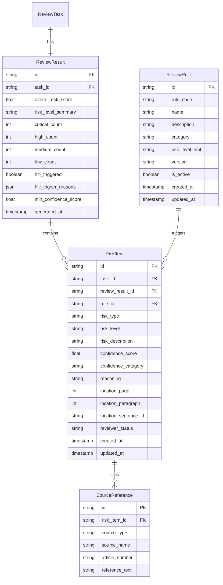

# 审核规则、风险命中项、审核结果与原文定位数据模型

**阶段**：07_data_model  
**输出方**：Teammate 2  
**日期**：2026-04-15  
**版本**：v1.0  
**依据文档**：
- `docs/04_interaction_design/interactive-design-spec-v1.0.md`（第三、五章）
- `docs/06_system_architecture/backend-service-arch-spec.md`
- `docs/06_system_architecture/frontend-backend-boundary-spec.md`（§三.2 置信度）
- `docs/03_problem_modeling/problem_modeling.md`（置信度分级、HITL触发条件）

---

## 一、概述

本文件覆盖以下核心实体：

| 实体 | 用途 |
|------|------|
| `ReviewRule` | 审核规则定义，描述"应检查什么"，是 RiskItem 的驱动来源 |
| `RiskItem` | 单条风险命中项，AI 审核的最小输出单元 |
| `ReviewResult` | 整体审核结果汇总，关联到 ReviewTask |
| `TextLocation` | 原文定位结构，内嵌在 RiskItem 中（MVP 段落级，V1 句子级预留） |
| `SourceReference` | 法规/条款来源引用，关联到 RiskItem |

---

## 二、实体关系图



---

## 三、实体详细字段说明

### 3.1 ReviewRule — 审核规则定义

| 字段名 | 类型 | 必填 | 标注 | 说明 |
|--------|------|------|------|------|
| `id` | VARCHAR(36) | 是 | [BE Required] | UUID |
| `rule_code` | VARCHAR(64) | 是 | [BE Required] | 规则唯一编码，如 `PAY_PENALTY_CLAUSE`，用于程序引用 |
| `name` | VARCHAR(256) | 是 | [FE Required] [BE Required] | 规则名称，前端规则说明展示 |
| `description` | TEXT | 否 | [FE Required] | 规则说明，解释该规则检查什么 |
| `category` | VARCHAR(64) | 是 | [FE Required] [BE Required] | 规则分类，如 `payment`、`liability`、`term`、`confidentiality` |
| `risk_level_hint` | ENUM | 是 | [BE Required] | 命中该规则时的默认风险等级建议，见枚举 §四.2 |
| `version` | VARCHAR(32) | 是 | [BE Required] | 规则版本号，RiskItem 引用此版本做审计追溯 |
| `is_active` | BOOLEAN | 是 | [BE Required] | 是否生效，默认 true；停用规则不再触发新的 RiskItem |
| `created_at` | TIMESTAMP | 是 | [BE Required] | 规则创建时间 |
| `updated_at` | TIMESTAMP | 是 | [BE Required] | 规则最后更新时间 |

### 3.2 ReviewResult — 整体审核结果汇总

| 字段名 | 类型 | 必填 | 标注 | 说明 |
|--------|------|------|------|------|
| `id` | VARCHAR(36) | 是 | [BE Required] | UUID |
| `task_id` | VARCHAR(36) | 是 | [BE Required] | 外键 → ReviewTask.id（唯一，1:1关系） |
| `overall_risk_score` | FLOAT | 是 | [FE Required] [BE Required] | 整体风险评分（0–100），前端顶部评分展示 |
| `risk_level_summary` | ENUM | 是 | [FE Required] [BE Required] | 整体风险等级，见枚举 §四.2；由后端基于 RiskItem 分布计算 |
| `critical_count` | INT | 是 | [FE Required] [BE Required] | Critical 级别风险项数量，前端风险看板展示 |
| `high_count` | INT | 是 | [FE Required] [BE Required] | High 级别风险项数量 |
| `medium_count` | INT | 是 | [FE Required] [BE Required] | Medium 级别风险项数量 |
| `low_count` | INT | 是 | [FE Required] [BE Required] | Low 级别风险项数量 |
| `hitl_triggered` | BOOLEAN | 是 | [BE Required] | 是否触发人工审核，由后端 HITL 判断逻辑写入 |
| `hitl_trigger_reasons` | JSON | 否 | [BE Required] | HITL触发原因列表，如 `["critical_count > 0", "min_confidence < 50%"]`；`hitl_triggered=true` 时必填 |
| `min_confidence_score` | FLOAT | 是 | [BE Required] | 所有 RiskItem 中最低置信度分值，用于 HITL 判断 |
| `generated_at` | TIMESTAMP | 是 | [FE Required] [BE Required] | 审核结果生成时间，审核报告页展示 |

### 3.3 RiskItem — 风险命中项

| 字段名 | 类型 | 必填 | 标注 | 说明 |
|--------|------|------|------|------|
| `id` | VARCHAR(36) | 是 | [BE Required] | UUID |
| `task_id` | VARCHAR(36) | 是 | [FE Required] [BE Required] | 外键 → ReviewTask.id，**一级索引**，前端按任务查询所有风险项走此索引 |
| `review_result_id` | VARCHAR(36) | 是 | [BE Required] | 外键 → ReviewResult.id |
| `rule_id` | VARCHAR(36) | 否 | [BE Required] | 外键 → ReviewRule.id，记录触发该风险项的规则（含版本）；LLM深度分析生成的条目可为null |
| `risk_type` | VARCHAR(64) | 是 | [FE Required] [BE Required] | 风险类型标签，如 `missing_penalty_clause`、`unfair_liability`；**不可被人工编辑** |
| `risk_level` | ENUM | 是 | [FE Required] [BE Required] | 风险等级，见枚举 §四.2；人工可编辑 |
| `risk_description` | TEXT | 是 | [FE Required] [BE Required] | 风险描述说明；人工可编辑 |
| `confidence_score` | FLOAT | 是 | [FE Required] [BE Required] | 置信度分值（0–100）；**不可被人工编辑** |
| `confidence_category` | ENUM | 是 | [FE Required] [BE Required] | 置信度类别，见枚举 §四.3；**由后端计算，前端只做颜色渲染，不自行计算** |
| `reasoning` | TEXT | 否 | [FE Required] [BE Required] | AI推理说明；`confidence_score < 70`（即 `legal` 类别）时**必填**；人工可编辑 |
| `location_page` | INT | 是 | [FE Required] [BE Required] | 原文所在页码（1-based），PDF高亮定位必须 |
| `location_paragraph` | INT | 是 | [FE Required] [BE Required] | 原文所在段落编号（1-based，页内相对编号），MVP精度 |
| `location_sentence_id` | VARCHAR(64) | 否 | [FE Required] | **V1 预留字段**，句子级定位ID，MVP 阶段为 null |
| `reviewer_status` | ENUM | 是 | [FE Required] [BE Required] | 审核人操作状态，见枚举 §四.4；初始为 `pending` |
| `created_at` | TIMESTAMP | 是 | [BE Required] | 风险项生成时间 |
| `updated_at` | TIMESTAMP | 是 | [BE Required] | 最后更新时间（人工编辑后更新） |

### 3.4 SourceReference — 法规来源引用

| 字段名 | 类型 | 必填 | 标注 | 说明 |
|--------|------|------|------|------|
| `id` | VARCHAR(36) | 是 | [BE Required] | UUID |
| `risk_item_id` | VARCHAR(36) | 是 | [BE Required] | 外键 → RiskItem.id |
| `source_type` | ENUM | 是 | [FE Required] [BE Required] | 来源类型，见枚举 §四.5 |
| `source_name` | VARCHAR(512) | 是 | [FE Required] [BE Required] | 法规/标准名称，如"中华人民共和国合同法" |
| `article_number` | VARCHAR(64) | 否 | [FE Required] | 条款编号，如"第六十条"，前端引用说明展示 |
| `reference_text` | TEXT | 否 | [FE Required] | 引用原文内容，前端展开式详情中展示 |

---

## 四、枚举类型定义

### 4.1 RiskItem.risk_type（示例值，非穷举）

| 枚举值 | 含义 |
|--------|------|
| `missing_penalty_clause` | 缺少违约金条款 |
| `unfair_liability` | 不公平责任分配 |
| `ambiguous_payment_term` | 模糊付款条款 |
| `excessive_ip_transfer` | 过度知识产权转让 |
| `missing_force_majeure` | 缺少不可抗力条款 |
| `unlimited_confidentiality` | 无限期保密义务 |

> 注：`risk_type` 为业务规则驱动的标签，由后端规则引擎或LLM产出，不在前端计算，此处仅列举示例。

### 4.2 风险等级（ReviewRule.risk_level_hint / RiskItem.risk_level / ReviewResult.risk_level_summary）

| 枚举值 | 含义 | 前端展示颜色 |
|--------|------|------------|
| `critical` | 严重风险，必须处理 | 红色 |
| `high` | 高风险，应当处理 | 橙色 |
| `medium` | 中等风险，建议关注 | 黄色 |
| `low` | 低风险，可接受 | 绿色 |

### 4.3 RiskItem.confidence_category — 置信度类别

> **重要约束**：`confidence_category` 由**后端计算后写入**，前端**不自行计算**，只根据此字段做颜色渲染。

| 枚举值 | confidence_score 范围 | 前端颜色 | 语义 |
|--------|----------------------|---------|------|
| `fact` | ≥ 90 | 绿色 | 高置信，合同主体、金额、日期等显式字段 |
| `clause` | 70–89 | 黄色 | 中置信，条款存在性检查 |
| `legal` | < 70 | 橙色 | 低置信，法律解释类输出，**必须附 reasoning 说明** |

### 4.4 RiskItem.reviewer_status — 审核人操作状态

| 枚举值 | 含义 | 前端展示 |
|--------|------|---------|
| `pending` | 待处理，尚未人工操作 | 默认状态，无特殊标记 |
| `approved` | 人工已确认，认同 AI 结论 | 绿色"已确认" |
| `edited` | 人工已编辑修改 AI 结论 | 蓝色"已编辑"，展示原值/新值 diff |
| `reviewer_rejected` | 单条被人工驳回 | 灰色"已驳回" |

### 4.5 SourceReference.source_type

| 枚举值 | 含义 |
|--------|------|
| `law` | 法律法规（全国人大立法） |
| `regulation` | 行政法规/部门规章 |
| `standard` | 行业标准/规范 |
| `internal_policy` | 企业内部合规政策 |
| `case_law` | 司法案例/判例 |

---

## 五、置信度分级规则说明

### 5.1 计算规则（后端执行）

```
confidence_score → confidence_category 映射规则：
  score ≥ 90  → "fact"   （高置信）
  70 ≤ score < 90 → "clause" （中置信）
  score < 70  → "legal"  （低置信，reasoning 字段必填）
```

### 5.2 前端展示规则（只渲染，不计算）

| confidence_category | 前端颜色 | 额外展示要求 |
|--------------------|---------|------------|
| `fact` | 绿色标签 | 无 |
| `clause` | 黄色标签 | 无 |
| `legal` | 橙色标签 | **必须展示 reasoning 字段内容** |

### 5.3 HITL 触发条件（由 ReviewResult 字段驱动）

| 触发条件 | 对应字段 | 阈值 |
|---------|---------|------|
| 存在严重/高风险项 | `critical_count > 0` 或 `high_count > 0` | 任意一个 > 0 |
| 最低置信度过低 | `min_confidence_score < 50` | 小于50% |
| 未知文档类型 | `Document.document_type = "unknown"` | — |
| 用户手动标记质疑 | ReviewTask 额外字段（非本文件范围） | — |

---

## 六、原文定位结构说明

### 6.1 MVP 阶段（段落级，当前实现）

```
RiskItem 内嵌字段：
  location_page      INT   -- 页码，1-based
  location_paragraph INT   -- 页内段落编号，1-based
```

**使用场景**：前端点击风险条目 → PDF.js 滚动至第 `location_page` 页，高亮第 `location_paragraph` 段落，高亮颜色与 `risk_level` 一致。

### 6.2 V1 阶段（句子级，预留字段）

```
RiskItem 预留字段：
  location_sentence_id  VARCHAR(64)  -- 句子级定位ID，格式待V1定义
                                     -- MVP 阶段置 null，不影响现有逻辑
```

---

## 七、索引建议

| 表名 | 索引字段 | 索引类型 | 用途 |
|------|---------|---------|------|
| `ReviewResult` | `task_id` | 唯一索引 | 1:1关联查询 |
| `RiskItem` | `task_id` | 普通索引（**一级索引**） | 按任务查询全部风险项（高频查询） |
| `RiskItem` | `review_result_id` | 普通索引 | 按结果查询风险项 |
| `RiskItem` | `rule_id` | 普通索引 | 按规则统计命中情况 |
| `RiskItem` | `risk_level` | 普通索引 | 按风险等级过滤（Critical/High先处理） |
| `RiskItem` | `reviewer_status` | 普通索引 | 查询待处理/已处理条目 |
| `RiskItem` | `(task_id, reviewer_status)` | 复合索引 | 完成审核条件校验（Critical/High全处理） |
| `SourceReference` | `risk_item_id` | 普通索引 | 按风险项查法规来源 |
| `ReviewRule` | `rule_code` | 唯一索引 | 规则编码唯一约束 |
| `ReviewRule` | `is_active` | 普通索引 | 过滤生效规则 |

---

## 八、前端必须字段汇总表（[FE Required]）

| 实体 | 字段 | 前端用途 |
|------|------|---------|
| `ReviewRule` | `name` | 风险条目中规则名称展示 |
| `ReviewRule` | `description` | 规则详情说明展示 |
| `ReviewRule` | `category` | 规则分类标签 |
| `ReviewResult` | `overall_risk_score` | 顶部整体风险评分（0-100） |
| `ReviewResult` | `risk_level_summary` | 整体风险等级色标 |
| `ReviewResult` | `critical_count` / `high_count` / `medium_count` / `low_count` | 风险看板数量统计 |
| `ReviewResult` | `generated_at` | 审核报告生成时间 |
| `RiskItem` | `task_id` | 关联查询标识 |
| `RiskItem` | `risk_type` | 风险类型标签展示 |
| `RiskItem` | `risk_level` | 风险等级颜色渲染 |
| `RiskItem` | `risk_description` | 风险描述正文展示 |
| `RiskItem` | `confidence_score` | 置信度数值展示 |
| `RiskItem` | `confidence_category` | 置信度颜色渲染（不自行计算） |
| `RiskItem` | `reasoning` | 低置信度时必须展示的推理说明 |
| `RiskItem` | `location_page` | PDF定位：跳转页码 |
| `RiskItem` | `location_paragraph` | PDF定位：段落高亮 |
| `RiskItem` | `location_sentence_id` | V1句子级高亮（MVP为null） |
| `RiskItem` | `reviewer_status` | 条目处理状态展示（颜色/标签） |
| `SourceReference` | `source_type` / `source_name` / `article_number` / `reference_text` | 条款详情展开区法规引用展示 |

---

## 九、后端必须字段汇总表（[BE Required]）

| 实体 | 字段 | 后端用途 |
|------|------|---------|
| `ReviewRule` | `rule_code` | 规则引擎程序引用 |
| `ReviewRule` | `version` | RiskItem 绑定规则版本做审计 |
| `ReviewRule` | `is_active` | 控制规则是否触发新命中项 |
| `ReviewResult` | `hitl_triggered` | HITL判断结果，驱动状态机流转 |
| `ReviewResult` | `hitl_trigger_reasons` | HITL触发依据，审计追溯 |
| `ReviewResult` | `min_confidence_score` | HITL触发条件计算 |
| `RiskItem` | `rule_id` | 规则版本追溯 |
| `RiskItem` | `confidence_category` | 由后端计算（不依赖前端） |
| `RiskItem` | `reasoning` | `legal` 类别时必须提供 |
| `RiskItem` | `reviewer_status` | 完成审核前置条件校验（Critical/High全处理） |

---

*本文档由 Teammate 2 设计，经 Lead 审批后落地。覆盖审核规则定义、风险命中项、整体审核结果汇总及原文定位数据模型，是后端规则引擎、AI审核结果存储以及前端双视图审核界面的直接规范输入。*
