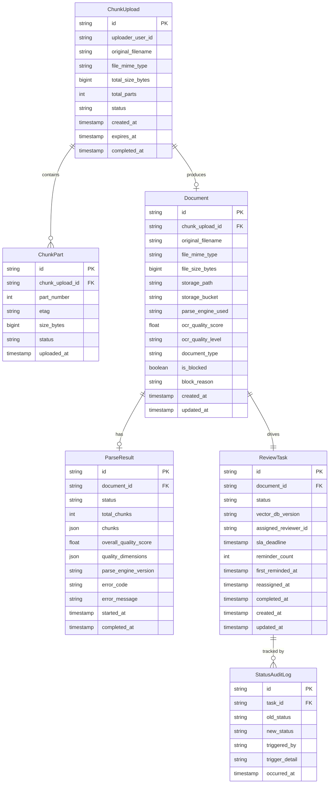

# 文档上传、解析、存储与任务状态数据模型

**阶段**：07_data_model  
**输出方**：Teammate 1  
**日期**：2026-04-15  
**版本**：v1.0  
**依据文档**：
- `docs/04_interaction_design/interactive-design-spec-v1.0.md`
- `docs/06_system_architecture/backend-service-arch-spec.md`
- `docs/06_system_architecture/frontend-backend-boundary-spec.md`

---

## 一、概述

本文件覆盖以下核心实体：

| 实体 | 用途 |
|------|------|
| `ChunkUpload` | 分片上传会话，追踪每次上传的整体状态 |
| `ChunkPart` | 单个分片记录，追踪 ETag 和上传状态 |
| `Document` | 文档元数据记录，关联解析引擎和OCR质量评估 |
| `ParseResult` | 文档解析产出，包含分块信息和质量评估详情 |
| `ReviewTask` | 审核任务，承载完整 11 态状态机，是所有后续审核流程的锚点 |
| `StatusAuditLog` | 状态变更专项审计日志（只追加，不修改/删除） |

---

## 二、实体关系图

---

## 三、实体详细字段说明

### 3.1 ChunkUpload — 分片上传会话

| 字段名 | 类型 | 必填 | 标注 | 说明 |
|--------|------|------|------|------|
| `id` | VARCHAR(36) | 是 | [BE Required] | UUID，由后端签发，作为分片上传的唯一会话标识 |
| `uploader_user_id` | VARCHAR(36) | 是 | [BE Required] | 上传发起人的用户ID |
| `original_filename` | VARCHAR(512) | 是 | [FE Required] | 原始文件名，用于前端展示 |
| `file_mime_type` | VARCHAR(64) | 是 | [BE Required] | MIME类型，如 `application/pdf`、`application/vnd.openxmlformats-officedocument.wordprocessingml.document` |
| `total_size_bytes` | BIGINT | 是 | [BE Required] | 文件总大小（字节） |
| `total_parts` | INT | 是 | [BE Required] | 总分片数（≥20MB 时按 5MB/片计算） |
| `status` | ENUM | 是 | [FE Required] [BE Required] | 见枚举定义 §四.1 |
| `created_at` | TIMESTAMP | 是 | [BE Required] | 会话创建时间 |
| `expires_at` | TIMESTAMP | 是 | [BE Required] | 断点续传有效期（`created_at` + 24小时） |
| `completed_at` | TIMESTAMP | 否 | [BE Required] | 上传完成时间，上传成功后由后端写入 |

### 3.2 ChunkPart — 单个分片记录

| 字段名 | 类型 | 必填 | 标注 | 说明 |
|--------|------|------|------|------|
| `id` | VARCHAR(36) | 是 | [BE Required] | UUID |
| `chunk_upload_id` | VARCHAR(36) | 是 | [BE Required] | 外键 → ChunkUpload.id |
| `part_number` | INT | 是 | [BE Required] | 分片序号，从 1 开始，最大值 = ChunkUpload.total_parts |
| `etag` | VARCHAR(128) | 否 | [BE Required] | 分片上传完成后由对象存储返回的校验哈希，合并前必填 |
| `size_bytes` | BIGINT | 是 | [BE Required] | 本分片实际大小（最后一片可能小于 5MB） |
| `status` | ENUM | 是 | [BE Required] | 见枚举定义 §四.2 |
| `uploaded_at` | TIMESTAMP | 否 | [BE Required] | 分片上传完成时间 |

### 3.3 Document — 文档记录

| 字段名 | 类型 | 必填 | 标注 | 说明 |
|--------|------|------|------|------|
| `id` | VARCHAR(36) | 是 | [BE Required] | UUID |
| `chunk_upload_id` | VARCHAR(36) | 是 | [BE Required] | 外键 → ChunkUpload.id，追溯来源上传会话 |
| `original_filename` | VARCHAR(512) | 是 | [FE Required] | 原始文件名，文档列表/详情页展示 |
| `file_mime_type` | VARCHAR(64) | 是 | [BE Required] | 文件MIME类型 |
| `file_size_bytes` | BIGINT | 是 | [FE Required] | 文件大小，前端展示"XX MB" |
| `storage_path` | VARCHAR(1024) | 是 | [BE Required] | 对象存储中的文件路径，不暴露给前端 |
| `storage_bucket` | VARCHAR(256) | 是 | [BE Required] | 对象存储桶名，不暴露给前端 |
| `parse_engine_used` | ENUM | 否 | [BE Required] | 实际使用的解析引擎，见枚举 §四.3；解析完成后写入 |
| `ocr_quality_score` | FLOAT | 否 | [FE Required] [BE Required] | OCR综合质量分（0-100），供前端展示警示；解析完成后写入 |
| `ocr_quality_level` | ENUM | 否 | [FE Required] [BE Required] | 质量等级，见枚举 §四.4；由后端基于 score 计算 |
| `document_type` | VARCHAR(64) | 否 | [FE Required] [BE Required] | 文档分类，如 `service_contract`、`procurement_contract`，Layer 1 分类后写入 |
| `is_blocked` | BOOLEAN | 是 | [BE Required] | 是否被硬拦截（融资股权文件等禁止类型），默认 false |
| `block_reason` | VARCHAR(512) | 否 | [FE Required] | 硬拦截原因，`is_blocked=true` 时必填，前端展示拦截说明 |
| `created_at` | TIMESTAMP | 是 | [BE Required] | 文档记录创建时间 |
| `updated_at` | TIMESTAMP | 是 | [BE Required] | 最后更新时间 |

### 3.4 ParseResult — 解析结果

| 字段名 | 类型 | 必填 | 标注 | 说明 |
|--------|------|------|------|------|
| `id` | VARCHAR(36) | 是 | [BE Required] | UUID |
| `document_id` | VARCHAR(36) | 是 | [BE Required] | 外键 → Document.id（唯一，1:1关系） |
| `status` | ENUM | 是 | [BE Required] | 解析状态，见枚举 §四.5 |
| `total_chunks` | INT | 否 | [BE Required] | 文档被分割的总段落/块数，解析完成后写入 |
| `chunks` | JSON | 否 | [BE Required] | 段落块数组，每个元素含 `{chunk_id, page_number, paragraph_index, text, char_count}`，供向量化使用 |
| `overall_quality_score` | FLOAT | 否 | [FE Required] [BE Required] | 综合质量分（冗余自 Document.ocr_quality_score，此处保存详细维度） |
| `quality_dimensions` | JSON | 否 | [BE Required] | 各评估维度分值，如 `{"text_clarity": 92, "layout_structure": 85, "char_recognition": 88}` |
| `parse_engine_version` | VARCHAR(64) | 否 | [BE Required] | 解析引擎版本号，用于审计 |
| `error_code` | VARCHAR(64) | 否 | [FE Required] | 解析失败错误码，前端根据此字段展示对应错误提示文案 |
| `error_message` | VARCHAR(1024) | 否 | [BE Required] | 解析失败详细原因（内部记录，不直接展示给用户） |
| `started_at` | TIMESTAMP | 否 | [BE Required] | 解析开始时间 |
| `completed_at` | TIMESTAMP | 否 | [BE Required] | 解析完成时间 |

### 3.5 ReviewTask — 审核任务

| 字段名 | 类型 | 必填 | 标注 | 说明 |
|--------|------|------|------|------|
| `id` | VARCHAR(36) | 是 | [BE Required] | UUID，WebSocket Channel 标识 |
| `document_id` | VARCHAR(36) | 是 | [BE Required] | 外键 → Document.id |
| `status` | ENUM | 是 | [FE Required] [BE Required] | 完整 11 态状态机，见枚举 §四.6 |
| `vector_db_version` | VARCHAR(64) | 是 | [BE Required] | 审核时绑定的向量库版本号，任务创建时写入，不可修改 |
| `assigned_reviewer_id` | VARCHAR(36) | 否 | [FE Required] [BE Required] | 当前人工审核员ID，`human_reviewing` 阶段由系统赋值，其他阶段为 null |
| `sla_deadline` | TIMESTAMP | 否 | [BE Required] | SLA截止时间，进入 `human_reviewing` 时设置（当前时间 + 60分钟） |
| `reminder_count` | INT | 是 | [BE Required] | 已发送催办次数，默认 0 |
| `first_reminded_at` | TIMESTAMP | 否 | [BE Required] | 首次催办时间（30分钟阈值触发） |
| `reassigned_at` | TIMESTAMP | 否 | [BE Required] | 重分配时间（60分钟阈值触发） |
| `completed_at` | TIMESTAMP | 否 | [FE Required] [BE Required] | 审核完成时间，进入终态时写入 |
| `created_at` | TIMESTAMP | 是 | [FE Required] [BE Required] | 任务创建时间，文档列表页展示 |
| `updated_at` | TIMESTAMP | 是 | [BE Required] | 最后更新时间 |

### 3.6 StatusAuditLog — 状态变更审计日志

> **约束：只追加，不修改，不删除。**

| 字段名 | 类型 | 必填 | 标注 | 说明 |
|--------|------|------|------|------|
| `id` | VARCHAR(36) | 是 | [BE Required] | UUID |
| `task_id` | VARCHAR(36) | 是 | [BE Required] | 外键 → ReviewTask.id |
| `old_status` | VARCHAR(32) | 否 | [BE Required] | 变更前状态（首次创建时为 null） |
| `new_status` | VARCHAR(32) | 是 | [BE Required] | 变更后状态 |
| `triggered_by` | ENUM | 是 | [BE Required] | 触发方，见枚举 §四.7 |
| `trigger_detail` | VARCHAR(512) | 否 | [BE Required] | 触发原因详情，如"SLA超期60分钟触发重分配"、"用户ID:xxx主动驳回" |
| `occurred_at` | TIMESTAMP | 是 | [BE Required] | 状态变更发生时间 |

---

## 四、枚举类型定义

### 4.1 ChunkUpload.status

| 枚举值 | 含义 |
|--------|------|
| `pending` | 会话已创建，等待分片上传 |
| `uploading` | 分片上传进行中 |
| `completed` | 所有分片上传完成，文件合并成功 |
| `expired` | 超过24小时有效期未完成，会话失效 |
| `failed` | 合并或校验失败 |

### 4.2 ChunkPart.status

| 枚举值 | 含义 |
|--------|------|
| `pending` | 分片待上传 |
| `uploaded` | 分片已上传，ETag已记录 |
| `failed` | 分片上传失败，可重试 |

### 4.3 Document.parse_engine_used

| 枚举值 | 含义 |
|--------|------|
| `direct_text` | 直接文本提取（PyMuPDF/pdfplumber） |
| `ocr_paddle` | PaddleOCR引擎 |
| `manual_fallback` | 降级人工处理 |

### 4.4 Document.ocr_quality_level

| 枚举值 | 含义 | score 范围 |
|--------|------|-----------|
| `high` | 高质量，正常进入审核 | ≥ 85 |
| `medium` | 中等质量，带警示继续 | 70–84 |
| `low` | 质量不足，降级人工 | < 70 |

### 4.5 ParseResult.status

| 枚举值 | 含义 |
|--------|------|
| `parsing` | 解析进行中 |
| `completed` | 解析完成 |
| `failed` | 解析失败 |

### 4.6 ReviewTask.status（完整 11 态）

| 枚举值 | 含义 | 状态类型 |
|--------|------|---------|
| `uploaded` | 已上传，等待解析 | 中间态 |
| `parsing` | 解析中 | 中间态 |
| `parsed` | 解析完成，等待自动审核 | 中间态 |
| `parse_failed` | 解析失败 | **终态** |
| `auto_reviewing` | 自动审核中（Layer 1/2/3） | 中间态 |
| `auto_review_failed` | 自动审核失败，可重试 | 可恢复失败态 |
| `auto_reviewed` | 自动审核完成，HITL判断中 | 中间态 |
| `human_reviewing` | 人工审核中 | 中间态 |
| `human_review_failed` | 人工审核失败 | 可恢复失败态 |
| `completed` | 审核完成 | **终态** |
| `rejected` | 任务被驳回 | **终态** |

> **规则**：三个终态（`parse_failed`、`completed`、`rejected`）不可回退；状态只能单向流转；任意状态均可流转至 `rejected`。

### 4.7 StatusAuditLog.triggered_by

| 枚举值 | 含义 |
|--------|------|
| `system` | 系统自动流转（AI审核完成、HITL判断等） |
| `user` | 用户主动操作（手动驳回、提交完成等） |
| `timeout` | SLA超时触发（30分钟催办、60分钟重分配） |

---

## 五、索引建议

| 表名 | 索引字段 | 索引类型 | 用途 |
|------|---------|---------|------|
| `ChunkPart` | `chunk_upload_id` | 普通索引 | 按会话查询所有分片 |
| `Document` | `chunk_upload_id` | 唯一索引 | 1:1关联查询 |
| `Document` | `document_type` | 普通索引 | 按文档类型过滤 |
| `Document` | `created_at` | 普通索引 | 文档列表按时间排序 |
| `ParseResult` | `document_id` | 唯一索引 | 1:1关联查询 |
| `ReviewTask` | `document_id` | 唯一索引 | 1:1关联查询 |
| `ReviewTask` | `status` | 普通索引 | 按状态过滤任务列表 |
| `ReviewTask` | `assigned_reviewer_id` | 普通索引 | 按审核人查询待处理任务 |
| `ReviewTask` | `sla_deadline` | 普通索引 | SLA监控定时扫描 |
| `ReviewTask` | `created_at` | 普通索引 | 任务列表时间排序 |
| `StatusAuditLog` | `task_id` | 普通索引 | 按任务查询状态历史 |
| `StatusAuditLog` | `occurred_at` | 普通索引 | 时间范围查询 |

---

## 六、前端必须字段汇总表（[FE Required]）

> 前端展示或交互逻辑强依赖的字段，后端 API 响应中**必须返回**。

| 实体 | 字段 | 前端用途 |
|------|------|---------|
| `ChunkUpload` | `original_filename` | 上传列表文件名展示 |
| `ChunkUpload` | `status` | 上传状态展示 |
| `Document` | `original_filename` | 文档列表/详情文件名 |
| `Document` | `file_size_bytes` | 展示文件大小"XX MB" |
| `Document` | `ocr_quality_score` | 解析质量分数展示与警示 |
| `Document` | `ocr_quality_level` | 决定前端警示样式（黄/橙） |
| `Document` | `document_type` | 文档类型标签展示 |
| `Document` | `block_reason` | 拦截原因提示文案 |
| `ParseResult` | `overall_quality_score` | 解析质量详情页展示 |
| `ParseResult` | `error_code` | 前端根据错误码匹配展示文案 |
| `ReviewTask` | `id` | WebSocket订阅Channel标识 |
| `ReviewTask` | `status` | 状态机驱动页面路由 |
| `ReviewTask` | `assigned_reviewer_id` | 审核人信息展示 |
| `ReviewTask` | `completed_at` | 完成时间展示 |
| `ReviewTask` | `created_at` | 任务列表创建时间 |

---

## 七、后端必须字段汇总表（[BE Required]）

> 后端业务逻辑强依赖的字段，**不得缺失或空值**（除非明确标注"解析后写入"）。

| 实体 | 字段 | 后端用途 |
|------|------|---------|
| `ChunkUpload` | `id` | 签发给前端作为分片上传会话ID |
| `ChunkUpload` | `expires_at` | 断点续传有效期控制 |
| `ChunkPart` | `etag` | 分片合并前校验完整性 |
| `ChunkPart` | `part_number` | 分片排序与合并 |
| `Document` | `storage_path` / `storage_bucket` | 文件实际存储定位（不暴露前端） |
| `Document` | `parse_engine_used` | 解析引擎审计追踪 |
| `Document` | `is_blocked` | 硬拦截校验，融资股权文件必须为 true |
| `ReviewTask` | `vector_db_version` | 绑定审核时向量库版本（不可修改） |
| `ReviewTask` | `sla_deadline` | SLA超时监控 |
| `ReviewTask` | `reminder_count` | 控制催办次数，防止重复催办 |
| `StatusAuditLog` | `triggered_by` | 区分系统/用户/超时触发，合规审计必须 |
| `StatusAuditLog` | `occurred_at` | 审计时间线重建 |

---

*本文档由 Teammate 1 设计，经 Lead 审批后落地。覆盖文档上传分片、解析、存储及ReviewTask状态机全链路数据模型，是后端实现 §二、§三、§五 以及前端上传/进度组件的直接规范输入。*
